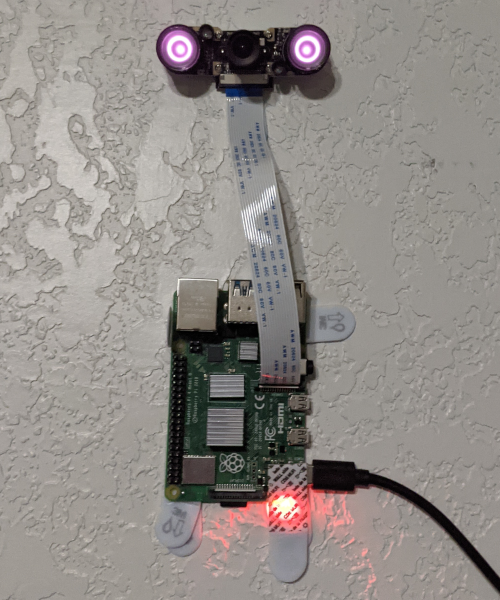

# RPiTimelapse
Simple Python scripts for a robust Raspberry Pi based Time-lapse Camera

## Why?

I wrote this code because I wanted to record a time-lapse of my sleep.

I decided to use a RasPi because I could reuse it for other projects once I am done with the time-lapses, and it already has a simple NoIR camera that comes with IR LEDs to illuminate the room.  

I wasn't satisfied with any of the time-lapse scripts I saw when googling, so I started throwing together my own.

## Hardware

The hardware is a Raspi 4 (8GB), 64GB SD card, a NoIR camera module, and some 3M wall tabs.

https://www.amazon.com/dp/B0759GYR51/ref=cm_sw_r_cp_apa_glt_fabc_EAY2AARVAEMHM364CBNP?_encoding=UTF8&psc=1

https://www.amazon.com/dp/B08DJ9MLHV/ref=cm_sw_r_cp_apa_glt_fabc_990RNZQ3B3P95Z7BYDF4?_encoding=UTF8&psc=1

https://www.amazon.com/dp/B08879MG33/ref=cm_sw_r_cp_apa_glt_fabc_4KMAKR15VKDWTX67D9Z2?_encoding=UTF8&psc=1

On my hardware, with the settings and code as is, the capture rate is 2 images per second.
Creating a time-lapse video for 1 hours worth of images takes about 15 minutes. 
Note: the time-lapse images and videos can take a lot of space, therefore, small SD cards may have issues with running out of space.

Note: 
If you run this on other hardware, you will probably have to tweak things.

## Setup

It is assumed that the OS & SD card are set up, that the camera is installed & enabled, and the timezone is set.

The `.py` files are expected to be written into the directory `/home/pi/`

For it to run on boot, use the command `sudo crontab -e` and paste the contents of the file [Crontab](./Crontab) into it.

## Use

At this point, it should be simple plug and play to record time-lapses.

It is also assumed that you will have a way to interact with it when you desire to retrieve the time-lapse video(s).
Mine is connected to wifi, and has `ssh` set up to access the console, I retrieve the time-lapse files using `scp` 

### Combining Hours into one Video

The file [combine_timelapse_video.py](./combine_timelapse_video.py) is used to combine many hour time-lapse videos into a single video for download or viewing.

The default values in the file are from 10 PM (the night before) to 6:59 AM (today), you will have to edit the script to run for any other time frame (I will eventually take command line args).

I do this with `sudo nano combine_timelapse_video.py` and then the start and end can be changed by changing the variables `start_hour`, `end_hour`, and `days_combine`. If you want it to not end on today's date, then you need to adjust the variable `default_start` to be the desired start date.

### Manual running hours that failed

If the Pi is powered off when the hour switches to the next (or during the time-lapse video creation) then that hour will not be processed.

The code does not yet go back to 'fix' hours that were not processed, but the images can be processed by manually running the script [manual_hourly_timelapse_video.py](./manual_hourly_timelapse_video.py)

You will need to edit it to give it the correct Date and Hour to run the process for (I will eventually take command line args).
I do this with `sudo nano manual_hourly_timelapse_video.py` and then alter the value of the variable `hour` and if needed, the value of `today` to the desired day. 

### Installed Packages

`sudo apt update`
`sudo apt install -y ffmpeg`
`sudo -H apt install python3-picamera`
`sudo apt-get install imagemagick python3-imagick`

### Other Uses

If you wish to use this for other things like night sky time-lapses, you will probably want to tweak it quite a bit.
Feel free to submit pull requests or bug reports if the changes don't impact other uses. 

## Misc

Note: Python and Linux are not my daily drivers, so, if I made a dumb mistake, let me know.

